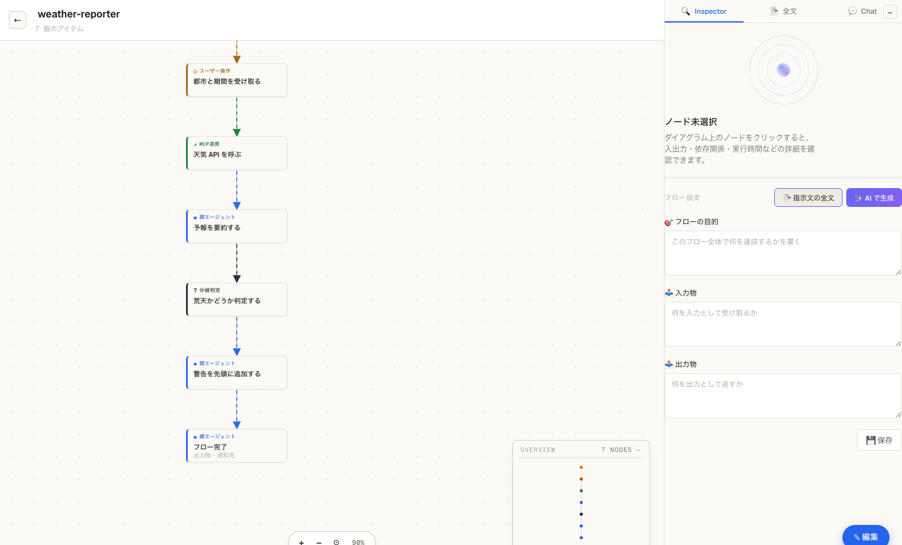
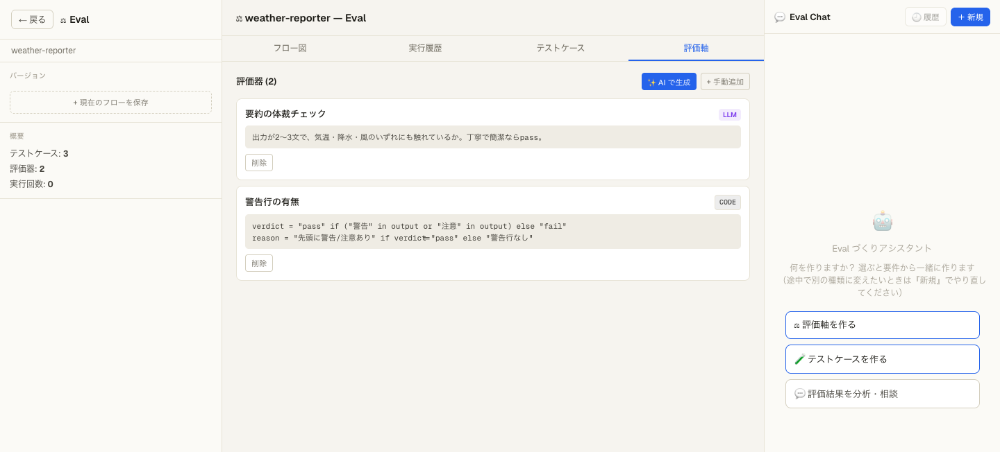
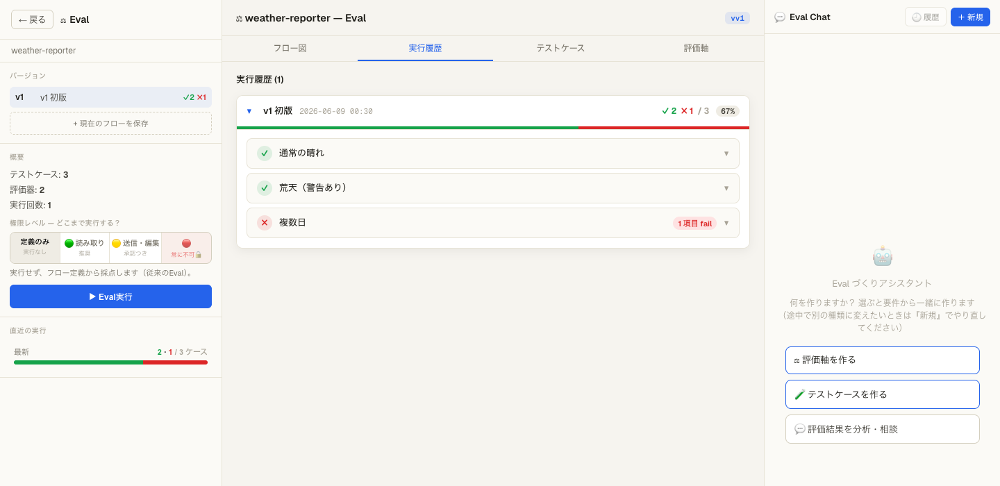

# Flow Inspector

**日本語** · [English README → `README.md`](README.md)

> Claude Code の設定をフロー図で可視化・編集するローカルダッシュボード（Claude Code プラグイン）。
>
> 1つのマーケットプレイスから2エディションを配布しています: **`flow-inspector`**（日本語UI）と **`flow-inspector-eng`**（英語UI）。好きな方をインストールしてください。

Flow Inspector は、あなたの PC の Claude Code 設定（**スキル / サブエージェント / フック / MCP / コマンド / CLAUDE.md**）を自動スキャンして、「いま自分の Claude Code がどう動くのか」を**フロー図**で見える化し、**JSON を書かずに**（ノーコードで）編集できるツールです。


> ※ 上図はサンプル設定での表示例です。

- 🗺 **ダッシュボード** — `~/.claude/` を解析して、スキル・サブエージェント・フック・コマンド・MCP・CLAUDE.md 階層を一覧表示
- 🔀 **フロー図** — 各設定の実行フローをノード／エッジで表示。ドラッグでノードを追加・編集
- ✏️ **ノーコード編集** — ノードをクリック → 設定タブで値を編集 → 「同期」で実ファイルに書き戻し
- 🧪 **eval ワークベンチ** — フローのバージョン管理・テストケース・評価器（LLM / コード）で挙動を検証

## 前提条件

- **Claude Code（`claude` CLI）が認証済み**で PATH にあること（AI 補助機能が利用します。API キーは不要）
- **Python 3.10 以上**（macOS / Linux。Windows は experimental）
- UI はビルド済みバンドルを同梱しており**オフラインでも起動**します（Web フォントのみ CDN 取得＝オフライン時はシステムフォントにフォールバック）。UI ソースは `plugins/flow-inspector/web/` に同梱、再ビルド手順は [BUILD.md](plugins/flow-inspector/BUILD.md) 参照

## インストール

Claude Code 上でプラグインとして導入します（このリポジトリ自体がマーケットプレイスを兼ねています）:

```
# 1. このリポジトリをマーケットプレイスとして追加
/plugin marketplace add o-chr/flow-inspector

# 2. プラグインをインストール（日本語UI）
/plugin install flow-inspector@flow-inspector-marketplace

# 英語UIで使いたい場合は、こちらを入れてください:
/plugin install flow-inspector-eng@flow-inspector-marketplace
```

> `o-chr/flow-inspector` は配布元の GitHub `ユーザー名/リポジトリ名` です。フォークやミラーから入れる場合はそこに合わせてください。

依存（FastAPI / uvicorn / PyYAML）の手動インストールは不要です。初回に下記のコマンドを実行したとき、プラグイン外の専用 venv（`~/.cache/flow-inspector/venv`）へ自動で入ります。

## 使い方（3ステップ）

専門的な知識がなくても、基本は次の3ステップで使えます。

### 1. ダッシュボードを開く

Claude Code で次のコマンドを実行します（`/flow` まで入力すると候補から選べます）:

```
/flow-inspector:flow-inspector
```

数秒で、ブラウザにダッシュボードが自動で開きます。

### 2. 設定を一覧で確認する

いまの Claude Code が、どのスキル・コマンド・ルール（CLAUDE.md）で動作しているかを一覧で確認できます。
この段階では AI は呼ばれない（＝**追加コストなし**）ため、自由にクリックして内容を確認できます。

### 3. 気になる設定を「フロー図」にする

詳しく見たいスキルやコマンドの行で **「▶ フロー化」** を押すと、その設定を AI が解析し、「何を・どの順序で実行するか」をフロー図として表示します。


- フロー化されるのは**押した項目だけ**です（押さなければコストは発生しません）。
- 図のノード（四角）をクリックすると、内容の確認・編集ができます。
- 編集内容は、画面右上の **「⇡ 同期・反映」** を押すまで実際の設定ファイルには反映されません。安心して試せます。

フロー化すると、設定の処理の流れが次のような図として表示されます:



ノード（四角）をクリックすると、右側のパネルでそのステップの役割・入力・出力・設定を確認・編集できます（コードや JSON を直接書く必要はありません）:


### 終了する

使い終わったら、次のコマンドで停止します。

```
/flow-inspector:flow-inspector stop
```

> **コマンド名について**: スラッシュコマンドは `プラグイン名:スキル名` の形式で、本プラグインは名称が共通のため `/flow-inspector:flow-inspector` となります。`/flow` まで入力して候補から選ぶと簡単です。

### （上級者向け）手動で起動・停止する

スラッシュコマンドを使えば下記は自動で行われます。手動起動は開発・デバッグ用です。

```bash
# 専用 venv を用意（初回のみ。依存をシステムや他プロジェクトと混ぜない）
FI_VENV="$HOME/.cache/flow-inspector/venv"
python3 -m venv "$FI_VENV"
"$FI_VENV/bin/pip" install -r "<plugin>/server/requirements.txt"

# その venv で起動（ポートは環境変数 FLOW_INSPECTOR_PORT で変更可）
cd "<plugin>" && "$FI_VENV/bin/python" -m uvicorn server.main:app --host 127.0.0.1 --port 8077
```

停止: macOS / Linux は `pkill -f "uvicorn server.main:app"`、Windows は `taskkill /F /IM python.exe`（該当プロセスのみ）。

## eval（評価）— ワークフローの動作を検証する（任意・やや高度）

作成・調整したワークフローが意図どおりに動作するかを検証する機能です。テストのように、入力例を与えて期待どおりかを判定します。日常的な利用では必須ではありません。

フロー図の上部にある **「⚖ Eval」** から開きます。手順は3つです:

1. **テストケースを用意する** — 「この入力に対して、こうあってほしい」という例を登録します（**AI による自動生成**も可能です）。
2. **評価軸（合格条件）を決める** — 2種類から選べます:
   - **AI による判定** — 「丁寧な表現になっているか」「必要な項目が揃っているか」などを文章で指定すると、AI が合否を判定します。
   - **コードによる判定** — 機械的に厳密な確認を行いたい場合に使います（短い Python。エンジニア向け）。

   

3. **まとめて実行する** — すべての「テストケース × 評価軸」を実行し、ケースごとの合否を一覧で表示します。

   

ワークフローの修正前後で結果を比較すれば、変更による改善・悪化を確認できます。
ワークフローを**実際に実行**して出力を生成し、その出力を評価することもできます。その際、削除や送信などの**副作用のある操作は既定でブロック**され、必要なものだけ承認して実行できます。

> 実行時は AI（判定・テストケース生成）を呼び出すためトークンを消費します。コード評価器の注意点は下記「既知の制約」を参照してください。

## トークン消費について

- **起動・ダッシュボード表示は 0 トークン**です。設定のスキャンとフロー図化は決定論的に行われ、AI（Claude）は呼ばれません。
- AI を使う（＝トークンを消費する）のは次の操作だけです:
  - **スキルのフロー化（アノテート）** — 起動時は未フロー化スキルの**件数を知らせるだけ**で、AI は呼ばれません。実際のフロー化は、ダッシュボードで各スキル/コマンドの **「▶ フロー化」ボタン**（または一覧上部の一括「▶ フロー化 (N)」）を**自分で押したとき**だけ走ります。押した分だけ AI を呼びます。
  - 各種 **チャット / 設計 / eval の生成・判定** ボタンを押したとき。
- フロー化は 1 スキルにつき 1 回 AI を呼びます。冪等＆キャッシュ付きなので、一度フロー化したスキルは再実行されず、プラグインを再起動しても保持されます。

## データの保存先

編集の作業コピー・プランボード・通知・eval 結果は **`~/.cache/flow-inspector/`** に保存されます。
本番の `~/.claude/` 配下は、ダッシュボードで明示的に「同期（push）」するまで変更されません（安全側）。

## 既知の制約

- UI はビルド済み JS/CSS バンドル（`static/assets/`）を同梱。オフラインでも動作します（Web フォントのみ CDN）。UI ソースは `plugins/flow-inspector/web/`（React 18 + Vite）に同梱しており、`cd plugins/flow-inspector/web && npm install && npm run build` で `static/` を再生成できます（詳細は [BUILD.md](plugins/flow-inspector/BUILD.md)）。
- eval の **コード評価器は任意の Python を実行**します（サンドボックスは subprocess 分離・環境変数を除去・実行時間制限つきですが、完全な隔離ではありません）。**信頼できるコードのみ登録**してください。サーバーを `127.0.0.1` 以外に公開する場合は特に注意してください。
- サーバーは `127.0.0.1`（ローカルのみ）にバインドします。
- Windows サポートは experimental（起動・停止コマンドは macOS / Linux 前提）。

## ライセンス

[MIT](LICENSE) © 2026 chr

個人・商用を問わず自由に利用・改変できます。
なお、本プロジェクトは将来のバージョンでライセンスが変更される可能性があります（各バージョンは、その時点で付与されたライセンスのもとで有効です）。

## 開発・テスト

```bash
pip install -r plugins/flow-inspector/server/requirements.txt -r requirements-dev.txt
python -m pytest tests/ -q
```

フロントエンド（`plugins/flow-inspector/web/`）を改変したら、[BUILD.md](plugins/flow-inspector/BUILD.md) に従って再ビルドし、生成物を `static/` に反映してください:

```bash
cd plugins/flow-inspector/web && npm install && npm run build   # base=/static/ で web/dist/ を生成
# 出力を static/ に反映（BUILD.md 参照）
```
