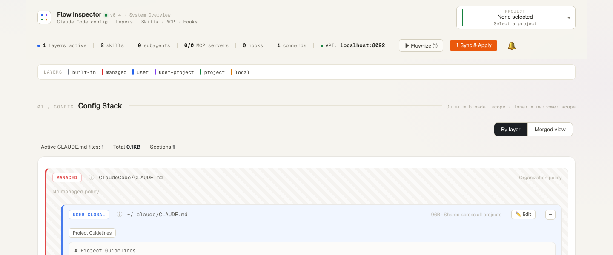
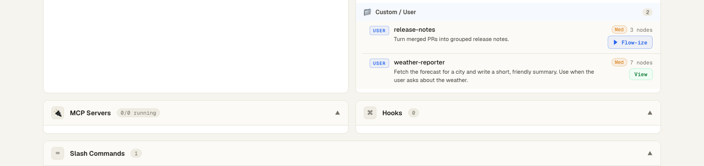
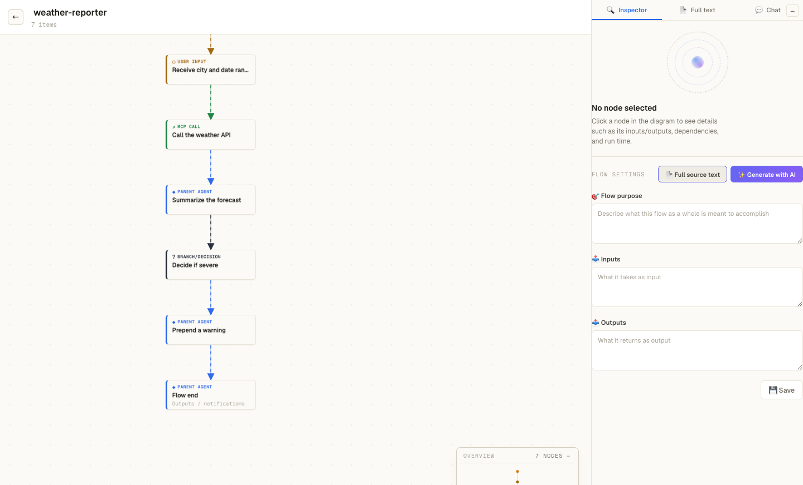
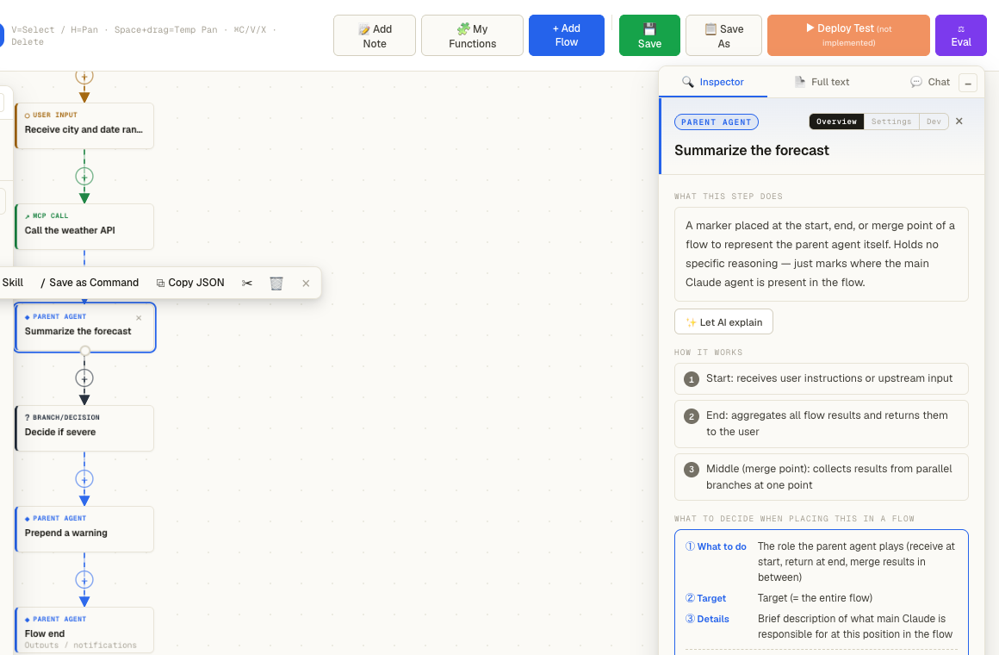
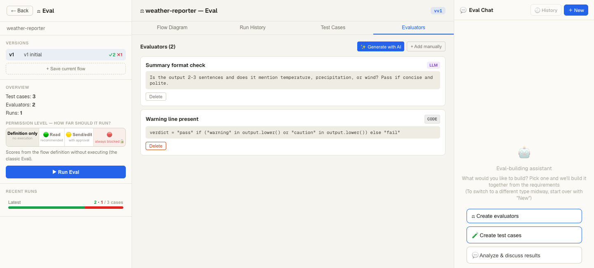
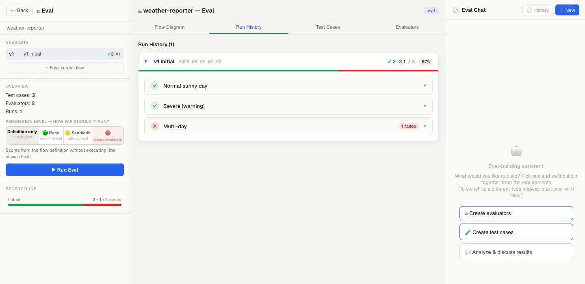

# Flow Inspector

**English** · [日本語版 README → `README.ja.md`](README.ja.md)

> A local dashboard Claude Code plugin that visualizes and edits your Claude Code configuration as flow diagrams.
>
> Available in two editions from this one marketplace: **`flow-inspector-eng`** (English UI) and **`flow-inspector`** (Japanese UI). Install whichever you prefer.

Flow Inspector automatically scans your Claude Code configuration — **skills / subagents / hooks / MCP servers / commands / CLAUDE.md** — and lets you see exactly how your Claude Code is set up through **flow diagrams**, with the ability to edit everything **without writing JSON** (no-code).



> Note: The screenshot above shows an example configuration.

- 🗺 **Dashboard** — Parses `~/.claude/` and displays your skills, subagents, hooks, commands, MCP servers, and CLAUDE.md hierarchy at a glance
- 🔀 **Flow diagrams** — Visualizes the execution flow of each configuration as nodes and edges; drag to add or rearrange nodes
- ✏️ **No-code editing** — Click a node → edit values in the settings panel → press "Sync" to write changes back to the actual files
- 🧪 **Eval workbench** — Validate behavior with flow versioning, test cases, and evaluators (LLM-based or code-based)

## Prerequisites

- **Claude Code (`claude` CLI) must be authenticated** and available on your PATH (used for AI-assisted features; no separate API key required)
- **Python 3.10 or higher** (macOS / Linux; Windows is experimental)
- The UI ships with a pre-built bundle and **works offline** (only web fonts are fetched from a CDN — falls back to system fonts when offline). UI source is included in `web/`; see [BUILD.md](BUILD.md) for rebuild instructions.

## Installation

Install as a Claude Code plugin (this repository also serves as its own marketplace):

```
# 1. Add this repository as a marketplace source
/plugin marketplace add o-chr/flow-inspector

# 2. Install the plugin (English UI)
/plugin install flow-inspector-eng@flow-inspector-marketplace

# Or, if you prefer a Japanese UI, install this one instead:
/plugin install flow-inspector@flow-inspector-marketplace
```

> `o-chr/flow-inspector` refers to the GitHub `username/repository` of the distribution source. If you are installing from a fork or mirror, substitute the appropriate value.

Dependencies (FastAPI / uvicorn / PyYAML) do not need to be installed manually. The first time you run the command below, they are installed automatically into a dedicated venv outside the plugin directory (`~/.cache/flow-inspector/venv`).

## Usage (3 steps)

No specialized knowledge is required. The basic workflow is three steps.

### 1. Open the dashboard

Run the following command in Claude Code (you can type `/flow` and select from the autocomplete suggestions):

```
/flow-inspector-eng:flow-inspector
```

After a few seconds, the dashboard opens automatically in your browser.

### 2. Review your configuration

See at a glance which skills, commands, and rules (CLAUDE.md) your current Claude Code session is operating with.
At this stage no AI is invoked — **there is no additional cost** — so feel free to click around and explore.

### 3. Turn a configuration item into a flow diagram

On any skill or command row you want to inspect, press **"▶ Flow-ize"** to have the AI analyze that configuration and display it as a flow diagram showing what it does and in what order.



- Only the **item you clicked** is flowized (no cost is incurred unless you press the button).
- Click any node (rectangle) in the diagram to view or edit its details.
- Edits are not written to your actual configuration files until you press **"⇡ Sync"** in the top-right corner — so you can experiment freely.

Once flowized, a skill's execution logic is displayed as a diagram like this:



Clicking a node opens a right-side panel where you can inspect and edit that step's role, inputs, outputs, and settings — no need to write code or JSON directly:



### Stopping the server

When you are done, run the following command to stop the server:

```
/flow-inspector-eng:flow-inspector stop
```

> **About the command name**: Slash commands follow the format `plugin-name:skill-name`. For this plugin the plugin name is `flow-inspector-eng` and the skill name is `flow-inspector`, giving `/flow-inspector-eng:flow-inspector`. Type `/flow` and select from the suggestions for convenience.

### (Advanced) Manual start and stop

The slash command handles all of this automatically. Manual startup is intended for development and debugging only.

```bash
# Set up the dedicated venv (first time only — keeps dependencies isolated from your system and other projects)
FI_VENV="$HOME/.cache/flow-inspector/venv"
python3 -m venv "$FI_VENV"
"$FI_VENV/bin/pip" install -r "<plugin>/server/requirements.txt"

# Start the server using that venv (override the port with the FLOW_INSPECTOR_PORT env var)
cd "<plugin>" && "$FI_VENV/bin/python" -m uvicorn server.main:app --host 127.0.0.1 --port 8077
```

To stop: on macOS / Linux run `pkill -f "uvicorn server.main:app"`; on Windows use `taskkill /F /IM python.exe` (targeting the relevant process only).

## Eval — Validating workflow behavior (optional, intermediate)

This feature lets you verify that a workflow you have built or tuned behaves as intended. Think of it as automated testing: you provide example inputs and define pass/fail criteria. It is not required for everyday use.

Access it via the **"⚖ Eval"** button at the top of any flow diagram. The process has three steps:

1. **Prepare test cases** — Register examples of the form "given this input, expect this output" (**AI-assisted auto-generation** is also available).
2. **Define evaluators (pass criteria)** — Choose from two types:
   - **AI judgment** — Describe the criteria in natural language (e.g., "Is the tone polite?", "Are all required fields present?") and the AI determines pass or fail.
   - **Code judgment** — For cases where you need strict, deterministic checks (short Python snippet; intended for developers).

   

3. **Run all** — Executes every combination of test case × evaluator and displays a pass/fail summary per case.

   

Comparing results before and after a workflow change lets you confirm whether the change was an improvement or a regression.
You can also **actually execute** the workflow to generate real output, then evaluate that output. Side-effectful operations (deletions, sends, etc.) are **blocked by default** and require explicit approval before running.

> Running eval consumes tokens for AI judgment and test case generation. See the "Known Limitations" section below for notes on the code evaluator.

## Token usage

- **Starting the server and viewing the dashboard costs 0 tokens.** Configuration scanning and flow diagram rendering are deterministic — the AI (Claude) is never invoked.
- AI is used (tokens are consumed) only for these explicit actions:
  - **Flowizing (annotating) a skill** — On startup, Flow Inspector only reports how many unflowized skills exist; the AI is not called. Actual flowization runs only when you **press the "▶ Flow-ize" button** (or the bulk "▶ Flow-ize (N)" button) for a specific skill or command in the dashboard. One button press = one AI call.
  - Pressing any **Chat / Design / Eval generate or judge** button.
- Flowization calls the AI once per skill. The result is idempotent and cached: a skill that has already been flowized will not be re-processed, and the result persists across plugin restarts.

## Data storage

Working copies of edits, plan boards, notifications, and eval results are stored in **`~/.cache/flow-inspector/`**.
Your live `~/.claude/` directory is never modified until you explicitly press "Sync (push)" in the dashboard — changes are safe by default.

## Known limitations

- The UI ships with a pre-built JS/CSS bundle (`static/assets/`) and works offline (web fonts require CDN access). The UI source is included in `web/` (React 18 + Vite); run `cd web && npm install && npm run build` to regenerate `static/` (see [BUILD.md](BUILD.md) for details).
- The eval **code evaluator executes arbitrary Python** (the sandbox uses subprocess isolation, strips environment variables, and enforces a timeout — but it is not a full sandbox). **Only register code you trust.** Exercise particular caution if you expose the server on an address other than `127.0.0.1`.
- The server binds to `127.0.0.1` (localhost only).
- Windows support is experimental (start/stop commands assume macOS / Linux).

## License

[MIT](LICENSE) © 2026 chr

Free to use and modify for personal and commercial purposes.
Note: the license for this project may change in future versions (each release remains valid under the license in effect at the time it was published).

## Development & testing

```bash
pip install -r server/requirements.txt -r requirements-dev.txt
PYTHONPATH=server python -m pytest tests/ -q
```

If you modify the frontend (`web/`), follow [BUILD.md](BUILD.md) to rebuild and copy the output to `static/`:

```bash
cd web && npm install && npm run build   # generates web/dist/ with base=/static/
# copy output to static/ (see BUILD.md)
```
