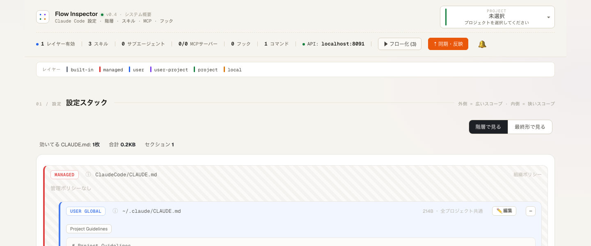
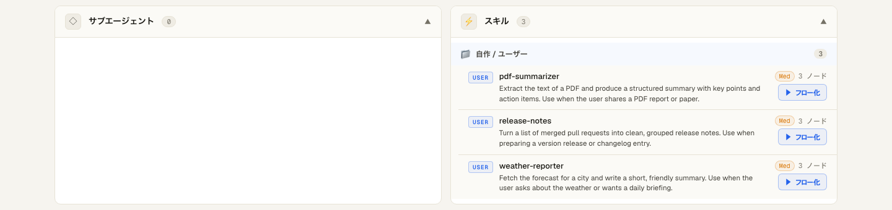

# Flow Inspector

> Claude Code の設定をフロー図で可視化・編集するローカルダッシュボード（Claude Code プラグイン）。

Flow Inspector は、あなたの PC の Claude Code 設定（**スキル / サブエージェント / フック / MCP / コマンド / CLAUDE.md**）を自動スキャンして、「いま自分の Claude Code がどう動くのか」を**フロー図**で見える化し、**JSON を書かずに**（ノーコードで）編集できるツールです。



> ※ 上図はサンプル設定での表示例です。

- 🗺 **ダッシュボード** — `~/.claude/` を解析して、スキル・サブエージェント・フック・コマンド・MCP・CLAUDE.md 階層を一覧表示
- 🔀 **フロー図** — 各設定の実行フローをノード／エッジで表示。ドラッグでノードを追加・編集
- ✏️ **ノーコード編集** — ノードをクリック → 設定タブで値を編集 → 「同期」で実ファイルに書き戻し
- 🧪 **eval ワークベンチ** — フローのバージョン管理・テストケース・評価器（LLM / コード）で挙動を検証

## 前提条件

- **Claude Code（`claude` CLI）が認証済み**で PATH にあること（AI 補助機能が利用します。API キーは不要）
- **Python 3.10 以上**（macOS / Linux。Windows は experimental）
- UI はビルド済みバンドルを同梱しており**オフラインでも起動**します（Web フォントのみ CDN 取得＝オフライン時はシステムフォントにフォールバック）。UI ソースは `web/` に同梱、再ビルド手順は [BUILD.md](BUILD.md) 参照

## インストール

Claude Code 上でプラグインとして導入します（このリポジトリ自体がマーケットプレイスを兼ねています）:

```
# 1. このリポジトリをマーケットプレイスとして追加
/plugin marketplace add chr/flow-inspector

# 2. プラグインをインストール
/plugin install flow-inspector@flow-inspector-marketplace
```

> `chr/flow-inspector` は配布元の GitHub `ユーザー名/リポジトリ名` です。フォークやミラーから入れる場合はそこに合わせてください。

依存（FastAPI / uvicorn / PyYAML）の手動インストールは不要です。初回に下記のコマンドを実行したとき、プラグイン外の専用 venv（`~/.cache/flow-inspector/venv`）へ自動で入ります。

## 使い方（かんたん3ステップ）

エンジニアでなくても大丈夫です。基本はこの3ステップだけ。

### 1. ダッシュボードを開く

Claude Code に、次のコマンドを入力します（`/flow` まで打つと候補から選べます）:

```
/flow-inspector:flow-inspector
```

数秒待つと、ブラウザに「ダッシュボード」の画面が**自動で開きます**。

### 2. 自分の設定をながめる

あなたの Claude Code が「いま、どんなスキル・コマンド・ルール（CLAUDE.md）で動いているか」が一覧で見えます。
この段階では AI は使われない（＝**料金はかかりません**）ので、安心してクリックして見て回れます。

### 3. 気になるものを「フロー図」にする

中身を詳しく見たいスキルやコマンドの行にある **「▶ フロー化」ボタン**を押します。
すると、その設定の中身を AI が読み解いて、「何を・どの順番でやるのか」を**図**にしてくれます。



- **押したものだけ**が対象です（押さなければ料金はかかりません）。
- 図になったら、四角（ノード）をクリックして中身を確認・編集できます。
- 編集しても、画面右上の **「⇡ 同期・反映」を押すまで、あなたの本物の設定ファイルは変わりません**。だから気軽に試せます。

### おわるとき

使い終わったら、次のコマンドで閉じます。

```
/flow-inspector:flow-inspector stop
```

> **コマンドが長い理由**: スラッシュコマンドは `プラグイン名:スキル名` という形式で、このプラグインは名前が両方 `flow-inspector` なので `/flow-inspector:flow-inspector` になります。`/flow` まで打って候補から選ぶのが楽です。

### （上級者向け）手動で起動・停止する

スラッシュコマンドを使えば下記は自動で行われます。手動起動は開発・デバッグ用です。

```bash
# 専用 venv を用意（初回のみ。依存をシステムや他プロジェクトと混ぜない）
FI_VENV="$HOME/.cache/flow-inspector/venv"
python3 -m venv "$FI_VENV"
"$FI_VENV/bin/pip" install -r "<plugin>/server/requirements.txt"

# その venv で起動（ポートは環境変数 FLOW_INSPECTOR_PORT で変更可）
cd "<plugin>" && "$FI_VENV/bin/python" -m uvicorn server.main:app --host 127.0.0.1 --port 8077
```

停止: macOS / Linux は `pkill -f "uvicorn server.main:app"`、Windows は `taskkill /F /IM python.exe`（該当プロセスのみ）。

## トークン消費について

- **起動・ダッシュボード表示は 0 トークン**です。設定のスキャンとフロー図化は決定論的に行われ、AI（Claude）は呼ばれません。
- AI を使う（＝トークンを消費する）のは次の操作だけです:
  - **スキルのフロー化（アノテート）** — 起動時は未フロー化スキルの**件数を知らせるだけ**で、AI は呼ばれません。実際のフロー化は、ダッシュボードで各スキル/コマンドの **「▶ フロー化」ボタン**（または一覧上部の一括「▶ フロー化 (N)」）を**自分で押したとき**だけ走ります。押した分だけ AI を呼びます。
  - 各種 **チャット / 設計 / eval の生成・判定** ボタンを押したとき。
- フロー化は 1 スキルにつき 1 回 AI を呼びます。冪等＆キャッシュ付きなので、一度フロー化したスキルは再実行されず、プラグインを再起動しても保持されます。

## データの保存先

編集の作業コピー・プランボード・通知・eval 結果は **`~/.cache/flow-inspector/`** に保存されます。
本番の `~/.claude/` 配下は、ダッシュボードで明示的に「同期（push）」するまで変更されません（安全側）。

## 既知の制約

- UI はビルド済み JS/CSS バンドル（`static/assets/`）を同梱。オフラインでも動作します（Web フォントのみ CDN）。UI ソースは `web/`（React 18 + Vite）に同梱しており、`cd web && npm install && npm run build` で `static/` を再生成できます（詳細は [BUILD.md](BUILD.md)）。
- eval の **コード評価器は任意の Python を実行**します（サンドボックスは subprocess 分離・環境変数を除去・実行時間制限つきですが、完全な隔離ではありません）。**信頼できるコードのみ登録**してください。サーバーを `127.0.0.1` 以外に公開する場合は特に注意してください。
- サーバーは `127.0.0.1`（ローカルのみ）にバインドします。
- Windows サポートは experimental（起動・停止コマンドは macOS / Linux 前提）。

## ライセンス

[MIT](LICENSE) © 2026 chr

個人・商用を問わず自由に利用・改変できます。
なお、本プロジェクトは将来のバージョンでライセンスが変更される可能性があります（各バージョンは、その時点で付与されたライセンスのもとで有効です）。

## 開発・テスト

```bash
pip install -r server/requirements.txt -r requirements-dev.txt
PYTHONPATH=server python -m pytest tests/ -q
```

フロントエンド（`web/`）を改変したら、[BUILD.md](BUILD.md) に従って再ビルドし、生成物を `static/` に反映してください:

```bash
cd web && npm install && npm run build   # base=/static/ で web/dist/ を生成
# 出力を static/ に反映（BUILD.md 参照）
```
